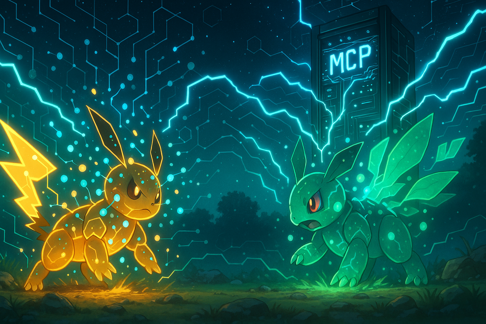
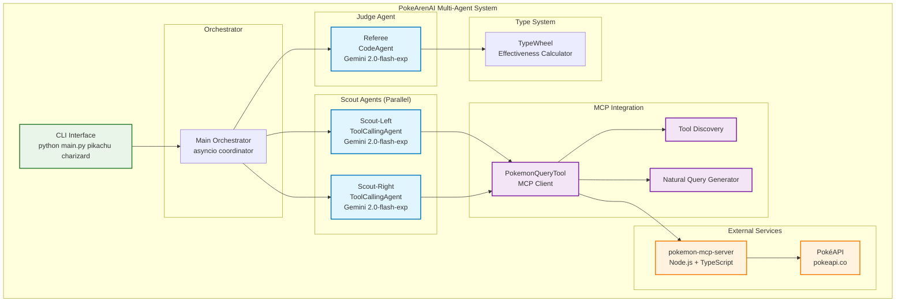
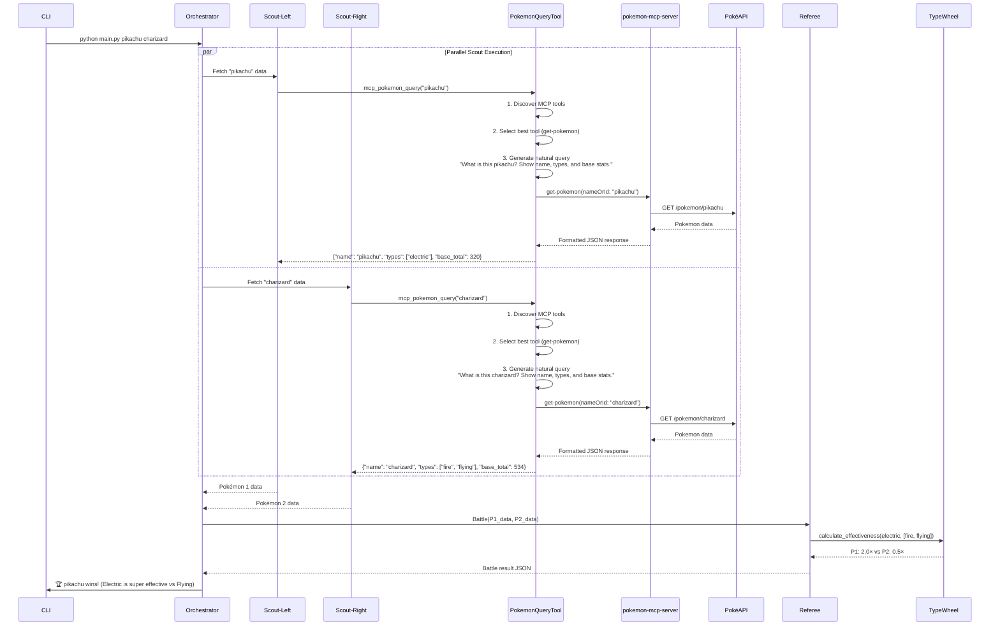
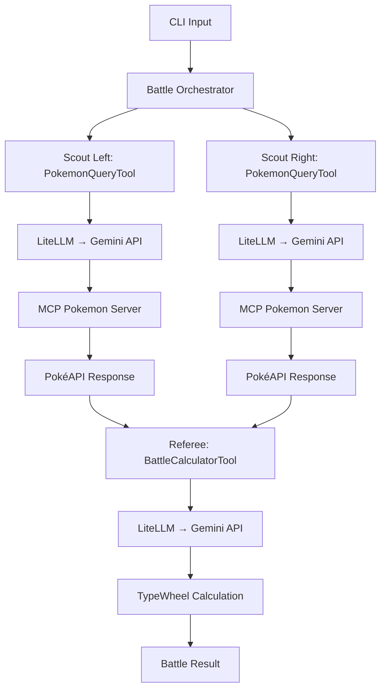

# 🔥 PokeArenAI - Multi-Agent Pokémon Battle System

Un sistema multi-agente avanzado que utiliza **smolagents** y **Google Gemini** para simular batallas Pokémon basadas en efectividad de tipos, obteniendo datos reales a través del **Model Context Protocol (MCP)** conectado a la **PokéAPI**.



## 📚 Tabla de Contenido

- [🏗️ Arquitectura del Sistema](#-arquitectura-del-sistema)
- [🤖 Componentes del Sistema](#-componentes-del-sistema)
- [🔄 Flujo de Ejecución](#-flujo-de-ejecución)
- [🛠️ Instalación y Configuración](#-instalación-y-configuración)
- [🎮 Uso](#-uso)
- [📁 Estructura del Proyecto](#-estructura-del-proyecto)
- [🔧 Arquitectura Técnica](#-arquitectura-técnica)
- [🚀 Características Avanzadas](#-características-avanzadas)
- [🐛 Troubleshooting](#-troubleshooting)
- [📄 Licencia](#-licencia)
- [🙏 Agradecimientos](#-agradecimientos)

## 🏗️ Arquitectura del Sistema



## 🤖 Componentes del Sistema

### 1. **Orchestrator Principal**
- **Función**: Coordinador maestro del sistema
- **Responsabilidades**:
  - Validación de entrada (exactamente 2 Pokémon)
  - Lanzamiento paralelo de agentes Scout
  - Handoff de resultados al Referee
  - Manejo de errores y salida final

### 2. **Scout Agents (Scout-Left & Scout-Right)**
- **Tipo**: `ToolCallingAgent` (smolagents)
- **LLM**: Google Gemini 2.0-flash-exp
- **Función**: Fetchers de datos especializados
- **Herramientas**: 
  - `PokemonQueryTool`: Cliente MCP integrado
- **Output**: JSON estructurado con datos del Pokémon
  ```json
  {
    "name": "pikachu",
    "types": ["electric"],
    "base_total": 320
  }
  ```

### 3. **PokemonQueryTool - Cliente MCP**
- **Descubrimiento dinámico**: Detecta automáticamente herramientas MCP disponibles
- **Selección inteligente**: Elige la mejor herramienta para cada consulta
- **Queries naturales**: Genera consultas en lenguaje natural dinámicamente
- **Herramientas MCP soportadas**:
  - `get-pokemon`: Obtener datos de Pokémon por nombre/ID ⭐ (Principal)
  - `get-type`: Información sobre tipos de Pokémon
  - `search-pokemon`: Buscar Pokémon con paginación
  - `get-move`: Detalles sobre movimientos
  - `get-ability`: Información sobre habilidades

### 4. **Referee Agent**
- **Tipo**: `CodeAgent` (smolagents)
- **LLM**: Google Gemini 2.0-flash-exp
- **Función**: Juez de batalla y calculador de efectividad
- **Capacidades**:
  - Ejecución de código Python para cálculos
  - Aplicación de reglas de efectividad de tipos
  - Generación de razonamiento divertido
- **Output**: Veredicto final de batalla

### 5. **pokemon-mcp-server (Externo)**
- **Repositorio**: https://github.com/indroneelray/pokemon-mcp-server
- **Tecnología**: Node.js + TypeScript
- **Protocolo**: MCP estándar (JSON-RPC 2.0)
- **Backend**: Se conecta directamente a PokéAPI
- **Instalación**: `npm install && npm run build && npm start`

### 6. **TypeWheel System**
- **Función**: Sistema de efectividad de tipos **100% fiel a la tabla oficial Pokémon**
- **Cobertura**: Todos los 18 tipos principales implementados
- **Reglas implementadas**:
  - **Super-efectivo (2.0×)**: Según tabla oficial (ej: electric→water/flying, fire→grass, water→fire/ground/rock)
  - **No muy efectivo (0.5×)**: Reverso exacto de super-efectivo
  - **Inmunidades (0.0×)**: electric→ground, ground→flying, normal/fighting→ghost, psychic→dark, poison→steel
  - **Tipos duales**: Multiplicación precisa de efectividades
  - **Atacante multi-tipo**: Selecciona el máximo multiplicador

#### 📊 Cómo Funciona la Tabla de Tipos

La tabla de efectividad sigue el estándar oficial de Pokémon con 3 niveles de daño:

**🎯 Super Efectivo (2.0×)**
```
Electric > Water, Flying    | Fire > Grass, Ice, Bug, Steel
Water > Fire, Ground, Rock  | Grass > Water, Ground, Rock  
Ice > Grass, Ground, Flying, Dragon | Fighting > Normal, Ice, Rock, Dark, Steel
Poison > Grass, Fairy       | Ground > Fire, Electric, Poison, Rock, Steel
Flying > Grass, Fighting, Bug | Psychic > Fighting, Poison
Bug > Grass, Psychic, Dark  | Rock > Fire, Ice, Flying, Bug
Ghost > Psychic, Ghost      | Dragon > Dragon
Dark > Psychic, Ghost       | Steel > Ice, Rock, Fairy
Fairy > Fighting, Dragon, Dark
```

**🛡️ No Muy Efectivo (0.5×)**
- Reverso exacto de super efectivo (ej: Water vs Grass = 0.5×)

**🚫 Inmunidades (0.0×)**
```
Electric → Ground (Tierra inmune a Eléctrico)
Ground → Flying (Volador inmune a Tierra)  
Normal/Fighting → Ghost (Fantasma inmune a Normal y Lucha)
Psychic → Dark (Siniestro inmune a Psíquico)
Poison → Steel (Acero inmune a Veneno)
```

**⚡ Tipos Duales**
- Para defensores con 2 tipos: se multiplican las efectividades
- Ejemplo: Ice vs Dragon/Flying = 2.0 × 2.0 = **4.0× (súper súper efectivo)**
- Si hay inmunidad: cualquier 0.0× hace el total = 0.0×

**🎮 Atacantes Multi-tipo**
- Selecciona el **máximo** multiplicador de todos los tipos del atacante
- Ejemplo: Fire/Flying vs Electric = max(Fire→Electric=1.0×, Flying→Electric=0.5×) = **1.0×**

#### 🧮 Ejemplos Prácticos de Cálculo

**Caso 1: Pikachu (Electric) vs Charizard (Fire/Flying)**
```
1. Electric vs Fire = 1.0× (daño normal)
2. Electric vs Flying = 2.0× (super efectivo)
3. Resultado: 1.0 × 2.0 = 2.0× (super efectivo)
✅ Pikachu tiene ventaja
```

**Caso 2: Charizard (Fire/Flying) vs Pikachu (Electric)**
```
1. Fire vs Electric = 1.0× (daño normal)
2. Flying vs Electric = 0.5× (no muy efectivo)
3. Multi-atacante: max(1.0×, 0.5×) = 1.0× (daño normal)
✅ Sin ventaja especial
```

**Caso 3: Geodude (Rock/Ground) vs Pidgeot (Normal/Flying)**
```
1. Rock vs Normal = 1.0×, Rock vs Flying = 2.0× → 1.0 × 2.0 = 2.0×
2. Ground vs Normal = 1.0×, Ground vs Flying = 0.0× → 1.0 × 0.0 = 0.0×
3. Multi-atacante: max(2.0×, 0.0×) = 2.0× (super efectivo)
✅ Rock efectivo, Ground inmune
```

**Caso 4: Alakazam (Psychic) vs Umbreon (Dark)**
```
1. Psychic vs Dark = 0.0× (inmunidad total)
✅ Umbreon completamente inmune
```

#### 🔍 Verificación de la Tabla de Tipos

Puedes probar la tabla de efectividad directamente en Python:

```python
from main import TypeWheel

tw = TypeWheel()

# Probar efectividades básicas
print("Electric vs Flying:", tw.get_multiplier("electric", "flying"))  # 2.0
print("Water vs Fire:", tw.get_multiplier("water", "fire"))  # 2.0
print("Electric vs Ground:", tw.get_multiplier("electric", "ground"))  # 0.0

# Probar tipos duales
print("Electric vs Fire/Flying:", tw.calculate_attack_multiplier(["electric"], ["fire", "flying"]))  # 2.0
print("Ice vs Dragon/Flying:", tw.calculate_attack_multiplier(["ice"], ["dragon", "flying"]))  # 4.0

# Probar multi-atacantes
print("Fire/Flying vs Electric:", tw.calculate_attack_multiplier(["fire", "flying"], ["electric"]))  # 1.0
```

**Referencia oficial**: [Tabla de tipos Pokémon - Vandal](https://vandal.elespanol.com/reportaje/tabla-de-tipos-de-pokemon-fortalezas-y-debilidades-en-todos-los-juegos)

## 🔄 Flujo de Ejecución



## 🛠️ Instalación y Configuración

### Prerequisitos
- Python 3.12+
- Node.js 18+
- API Key de Google Gemini

### 1. **Configurar pokemon-mcp-server**
```bash
# Clonar el servidor MCP
git clone https://github.com/indroneelray/pokemon-mcp-server.git
cd pokemon-mcp-server

# Instalar dependencias
npm install

# Compilar TypeScript
npm run build

# Iniciar servidor
npm start
# Servidor corriendo en modo MCP (stdin/stdout)
```

### 2. **Configurar PokeArenAI**
```bash
# Clonar este repositorio
git clone <este-repo>
cd multiagent-battle-pokemon

# Crear entorno virtual
python -m venv .venv
.venv\Scripts\activate  # Windows
# source .venv/bin/activate  # Linux/Mac

# Instalar dependencias
pip install -r requirements.txt
```

### 3. **Configurar API Key de Gemini**

#### **Paso 1: Obtener tu API Key**
1. Ve a [Google AI Studio](https://aistudio.google.com/)
2. Inicia sesión con tu cuenta de Google
3. Haz click en "Get API Key" o "Create API Key"
4. Copia tu API key (comenzará con `AIza...`)

#### **Paso 2: Configurar la Variable de Entorno**

**En Windows (PowerShell):**
```powershell
# Temporal (solo para la sesión actual)
$env:GEMINI_API_KEY="tu_api_key_aqui"

# Permanente (recomendado)
[Environment]::SetEnvironmentVariable("GEMINI_API_KEY", "tu_api_key_aqui", "User")
```

**En Windows (Command Prompt):**
```cmd
# Temporal
set GEMINI_API_KEY=tu_api_key_aqui

# Permanente
setx GEMINI_API_KEY "tu_api_key_aqui"
```

**En Linux/Mac:**
```bash
# Temporal
export GEMINI_API_KEY="tu_api_key_aqui"

# Permanente (añadir al ~/.bashrc o ~/.zshrc)
echo 'export GEMINI_API_KEY="tu_api_key_aqui"' >> ~/.bashrc
source ~/.bashrc
```

#### **Paso 3: Verificar la Configuración**
```bash
# Windows PowerShell
echo $env:GEMINI_API_KEY

# Linux/Mac
echo $GEMINI_API_KEY
```

⚠️ **Importante:** 
- **Nunca** compartas tu API key públicamente
- **Nunca** la incluyas en tu código fuente
- Mantén tu API key segura y privada
- La API key debe empezar con `AIza...`

💡 **Cuota Gratuita de Gemini:**
- Google Gemini ofrece 15 requests por minuto de forma gratuita
- Si superas el límite, espera ~30 segundos o considera upgrading tu plan

## 🎮 Uso

### Comando Básico
```bash
python main.py <pokemon1> <pokemon2>
```

### Ejemplos
```bash
# Batalla clásica
python main.py pikachu charizard

# Starter battle
python main.py bulbasaur squirtle

# Legendary vs Common
python main.py mew pikachu

# Dual types
python main.py garchomp flygon
```

### 🎬 Demo en Vivo

Aquí puedes ver el sistema en acción con el comando `python main.py pikachu charizard`:


**Lo que puedes observar en la demo:**
- 🕵️ **Scouts paralelos** recogiendo datos de Pikachu y Charizard via PokéAPI
- 🔍 **Descubrimiento automático** de 5 herramientas MCP disponibles
- ⚡ **Cálculos de efectividad** mostrando Electric (2.0×) vs Fire/Flying
- 🏆 **Decisión del referee** determinando que Pikachu gana por ventaja de tipo
- 📊 **Reporte completo** con stats, multiplicadores y confianza del resultado

### Salida de Ejemplo
```
🔥 PokeArenAI Battle: pikachu vs charizard
==================================================
🕵️ Deploying smolagents scouts...

🔍 Scout-Left discovering MCP tools...
✅ Found 5 tools: ['get-pokemon', 'get-type', 'search-pokemon', 'get-move', 'get-ability']
🎯 Selected tool: get-pokemon
💭 Generated query: 'What is this pikachu? Show name, types, and base stats.'
📡 Fetching from PokéAPI via MCP...
✅ pikachu: Electric type, base total 320

🔍 Scout-Right discovering MCP tools...
✅ Found 5 tools: ['get-pokemon', 'get-type', 'search-pokemon', 'get-move', 'get-ability']
🎯 Selected tool: get-pokemon
💭 Generated query: 'What is this charizard? Show name, types, and base stats.'
📡 Fetching from PokéAPI via MCP...
✅ charizard: Fire/Flying type, base total 534

⚔️ Referee calculating battle effectiveness...
🧮 Electric vs Fire/Flying: 2.0× effectiveness (Super effective!)
🧮 Fire/Flying vs Electric: 0.5× effectiveness (Not very effective)

🏆 WINNER: pikachu
🎯 REASON: Electric is super effective against Flying type, giving Pikachu the advantage
```

## 📁 Estructura del Proyecto

```
multiagent-battle-pokemon/
├── main.py                 # Sistema principal multi-agente
├── requirements.txt        # Dependencias Python
├── README.md              # Este archivo
├── pokemon.prompt.md      # Prompts del sistema (legacy)
├── main_picture.png      # Imagen del README
└── LICENSE               # Licencia MIT
```

## 🔧 Arquitectura Técnica

### 🤖 Framework Smolagents - Sistema Multi-Agente

El sistema utiliza **smolagents 1.21.3** de Hugging Face como framework principal para orquestar tres agentes especializados:

#### **1. Arquitectura de Agentes**

```python
from smolagents import HfApiModel, ToolCallingAgent

# Configuración del modelo LLM compartido
llm_model = LiteLLMModel(
    model_id="gemini/gemini-2.0-flash-exp",
    temperature=0.7
)

# Agente 1: Scout Izquierdo (Pokemon 1)
scout_left = ToolCallingAgent(
    tools=[pokemon_query_tool],
    model=llm_model,
    max_iterations=3,
    verbose=True
)

# Agente 2: Scout Derecho (Pokemon 2)  
scout_right = ToolCallingAgent(
    tools=[pokemon_query_tool],
    model=llm_model,
    max_iterations=3,
    verbose=True
)

# Agente 3: Referee (Calculador de Batalla)
referee = ToolCallingAgent(
    tools=[battle_calculator_tool],
    model=llm_model,
    max_iterations=5,
    verbose=True
)
```

#### **2. Patrón de Comunicación Multi-Agente**

```python
async def battle_orchestration(pokemon1_name, pokemon2_name):
    # FASE 1: Recolección paralela de datos
    tasks = [
        scout_left.run(f"Get data for {pokemon1_name}"),
        scout_right.run(f"Get data for {pokemon2_name}")
    ]
    pokemon_data = await asyncio.gather(*tasks)
    
    # FASE 2: Cálculo de batalla centralizado
    battle_prompt = f"""
    Calculate battle between:
    Pokemon 1: {pokemon_data[0]}
    Pokemon 2: {pokemon_data[1]}
    Determine winner using type effectiveness.
    """
    result = referee.run(battle_prompt)
    return result
```

#### **3. Especialización de Agentes**

| Agente | Herramientas | Función | Iteraciones |
|--------|-------------|---------|-------------|
| **Scout Left** | `PokemonQueryTool` | Datos del Pokemon 1 | Max 3 |
| **Scout Right** | `PokemonQueryTool` | Datos del Pokemon 2 | Max 3 |
| **Referee** | `BattleCalculatorTool` | Cálculo de batalla | Max 5 |

### 🧠 LiteLLM - Integración con Gemini

El sistema utiliza **LiteLLM** como abstracción para conectar smolagents con Google Gemini:

#### **1. Configuración del Modelo**

```python
from smolagents.models import LiteLLMModel

# Inicialización con configuración optimizada
llm_model = LiteLLMModel(
    model_id="gemini/gemini-2.0-flash-exp",  # Modelo más avanzado de Google
    temperature=0.7,                         # Balance creatividad/precisión
    max_tokens=2048,                        # Respuestas detalladas
    timeout=30,                             # Timeout robusto
)
```

#### **2. Gestión de Cuotas y Rate Limiting**

```python
# Rate limiting automático para Gemini free tier
# 15 requests/minute → ~4 segundos entre llamadas
async def with_rate_limit(agent_call):
    try:
        result = await agent_call()
        await asyncio.sleep(4.5)  # Respeta límites de Gemini
        return result
    except Exception as e:
        if "quota exceeded" in str(e):
            print("⚠️ Gemini quota exceeded - waiting...")
            await asyncio.sleep(60)  # Espera 1 minuto
            return await agent_call()  # Retry
        raise e
```

#### **3. Ventajas de LiteLLM + Smolagents**

- **Abstracción Universal**: Mismo código funciona con OpenAI, Anthropic, Gemini, etc.
- **Error Handling**: Manejo automático de errores de API y rate limits
- **Cost Tracking**: Seguimiento automático de tokens y costos
- **Async Support**: Operaciones no-bloqueantes para multi-agente
- **Prompt Templates**: Optimización automática para cada modelo

### 🔄 Flujo de Ejecución Detallado



### PokemonQueryTool - Detalles de Implementación

```python
class PokemonQueryTool(Tool):
    """
    Cliente MCP que:
    1. Descubre herramientas disponibles dinámicamente
    2. Selecciona la mejor herramienta para cada consulta
    3. Genera queries en lenguaje natural
    4. Se conecta al servidor MCP para obtener datos reales
    """
    
    def _discover_mcp_tools(self) -> Dict[str, Any]:
        """Detecta herramientas MCP disponibles"""
        
    def _select_pokemon_tool(self, tools) -> Dict[str, Any]:
        """Selecciona la mejor herramienta (prioriza get-pokemon)"""
        
    def _generate_natural_query(self, pokemon_name, style) -> str:
        """Genera queries naturales dinámicas"""
        
    def _call_mcp_tool(self, tool_info, pokemon_name, query) -> Dict:
        """Llama al servidor MCP y obtiene datos reales"""
```

### Flujo de Datos MCP

1. **Descubrimiento**: `_discover_mcp_tools()` → Encuentra 5 herramientas disponibles
2. **Selección**: `_select_pokemon_tool()` → Elige `get-pokemon` (prioridad 100)
3. **Query Natural**: `_generate_natural_query()` → `"What is this pikachu? Show name, types, and base stats."`
4. **Llamada MCP**: `_call_mcp_tool()` → Se conecta a PokéAPI via MCP server
5. **Formateo**: Convierte respuesta a formato estándar para el sistema de batalla

### 🛠️ Implementación Técnica Smolagents

#### **Tool System - Herramientas Especializadas**

```python
from smolagents import Tool

class PokemonQueryTool(Tool):
    name = "mcp_pokemon_query"
    description = "Connect to MCP server and query Pokemon data"
    inputs = {
        "pokemon_name": {"type": "string", "description": "Name of Pokemon to query"},
        "style": {"type": "string", "description": "Query style preference"}
    }
    output_type = "object"
    
    def forward(self, pokemon_name: str, style: str = "detailed") -> Dict:
        # Implementación del protocolo MCP
        return self._execute_mcp_query(pokemon_name, style)

class BattleCalculatorTool(Tool):
    name = "battle_calculator"
    description = "Calculate type effectiveness and determine winner"
    inputs = {
        "pokemon1_data": {"type": "object", "description": "First Pokemon data"},
        "pokemon2_data": {"type": "object", "description": "Second Pokemon data"}
    }
    output_type = "object"
    
    def forward(self, pokemon1_data: Dict, pokemon2_data: Dict) -> Dict:
        # Implementación del sistema TypeWheel
        return self._calculate_battle_result(pokemon1_data, pokemon2_data)
```

#### **Agent Configuration - Configuración Avanzada**

```python
# Configuración optimizada para batallas Pokemon
def create_battle_agents():
    base_config = {
        "model": LiteLLMModel(
            model_id="gemini/gemini-2.0-flash-exp",
            temperature=0.7,
            max_tokens=2048
        ),
        "verbose": True,
        "planning_interval": 3  # Re-planifica cada 3 iteraciones
    }
    
    # Scout especializado en recolección de datos
    scout_config = {
        **base_config,
        "max_iterations": 3,
        "system_prompt": """You are a Pokemon data scout. Your job is to:
        1. Query Pokemon data efficiently
        2. Extract relevant battle information
        3. Format data consistently
        Focus on name, types, and base stats."""
    }
    
    # Referee especializado en cálculos de batalla
    referee_config = {
        **base_config,
        "max_iterations": 5,
        "system_prompt": """You are a Pokemon battle referee. Your job is to:
        1. Analyze type effectiveness using official Pokemon rules
        2. Calculate battle outcomes fairly
        3. Provide detailed reasoning
        You have access to the complete type effectiveness chart."""
    }
    
    return scout_config, referee_config
```

#### **LiteLLM Advanced Features**

```python
# Configuración avanzada de LiteLLM para producción
llm_model = LiteLLMModel(
    model_id="gemini/gemini-2.0-flash-exp",
    
    # Performance tuning
    temperature=0.7,           # Balance precisión/creatividad
    max_tokens=2048,          # Respuestas completas
    top_p=0.9,               # Diversidad controlada
    
    # Reliability features
    timeout=30,              # Timeout generoso
    max_retries=3,           # Reintentos automáticos
    retry_delay=2,           # Delay entre reintentos
    
    # Cost optimization
    stream=False,            # Respuestas completas para agentes
    cache=True,              # Cache de respuestas similares
    
    # Error handling
    fallback_models=[        # Modelos de respaldo
        "gemini/gemini-1.5-flash",
        "gpt-3.5-turbo"
    ],
    
    # Monitoring
    log_requests=True,       # Logging para debugging
    track_cost=True          # Seguimiento de costos
)
```

#### **Async Multi-Agent Orchestration**

```python
import asyncio
from typing import List, Dict, Any

class BattleOrchestrator:
    def __init__(self):
        self.scout_left = None
        self.scout_right = None  
        self.referee = None
        self._setup_agents()
    
    async def execute_battle(self, pokemon1: str, pokemon2: str) -> Dict:
        """Orquesta una batalla completa usando múltiples agentes"""
        
        # FASE 1: Recolección paralela de datos (2 agentes)
        print("🕵️ Deploying scouts in parallel...")
        scout_tasks = [
            self._run_scout_with_timeout(self.scout_left, pokemon1, "left"),
            self._run_scout_with_timeout(self.scout_right, pokemon2, "right")
        ]
        
        # Ejecutar scouts en paralelo con timeout
        try:
            pokemon_data = await asyncio.wait_for(
                asyncio.gather(*scout_tasks), 
                timeout=45  # Timeout total para ambos scouts
            )
        except asyncio.TimeoutError:
            raise Exception("Scout timeout - MCP server may be slow")
        
        # FASE 2: Análisis de batalla (1 agente especializado)
        print("⚔️ Referee analyzing battle...")
        battle_result = await self._run_referee_with_retry(
            pokemon_data[0], pokemon_data[1]
        )
        
        return battle_result
    
    async def _run_scout_with_timeout(self, scout, pokemon_name, side):
        """Ejecuta un scout con manejo de errores y timeout"""
        try:
            result = await asyncio.wait_for(
                scout.arun(f"Get battle data for {pokemon_name}"),
                timeout=30
            )
            return self._parse_scout_result(result, pokemon_name)
        except Exception as e:
            print(f"⚠️ Scout {side} error: {e}")
            # Fallback a datos básicos
            return {"name": pokemon_name, "types": ["normal"], "base_total": 400}
    
    async def _run_referee_with_retry(self, p1_data, p2_data, max_retries=2):
        """Ejecuta el referee con reintentos en caso de error"""
        for attempt in range(max_retries + 1):
            try:
                prompt = self._build_referee_prompt(p1_data, p2_data)
                result = await self.referee.arun(prompt)
                return self._parse_referee_result(result)
            except Exception as e:
                if attempt == max_retries:
                    raise e
                print(f"⚠️ Referee retry {attempt + 1}/{max_retries}")
                await asyncio.sleep(2 ** attempt)  # Exponential backoff
```

## 🚀 Características Avanzadas

### 🤖 Smolagents Framework Benefits
- **Agent Specialization**: Cada agente optimizado para una tarea específica (scouts vs referee)
- **Tool System**: Herramientas encapsuladas con validación de inputs/outputs automática
- **Async Execution**: Soporte nativo para operaciones paralelas y no-bloqueantes
- **Planning & Iteration**: Agentes planifican y ajustan estrategia automáticamente
- **Robust Error Handling**: Sistema de reintentos y fallbacks integrado

### 🔗 LiteLLM Integration Advantages
- **Model Abstraction**: Mismo código funciona con cualquier LLM (OpenAI, Anthropic, Gemini)
- **Cost Optimization**: Seguimiento automático de tokens y costos por agente
- **Rate Limit Management**: Manejo automático de cuotas y límites de API
- **Fallback Models**: Cambio automático a modelos de respaldo si hay fallas
- **Streaming Support**: Respuestas en tiempo real para mejor UX

### 🔄 Sistema MCP Dinámico
- **Auto-descubrimiento**: `_discover_mcp_tools()` detecta herramientas disponibles dinámicamente
- **Tool Selection**: Algoritmo inteligente selecciona mejor herramienta por contexto
- **Adaptabilidad**: Se ajusta automáticamente si cambian las herramientas del servidor
- **Natural Queries**: LLM genera consultas en lenguaje natural contextualmente

### 🧠 Multi-Agent Intelligence
- **Parallel Execution**: Scouts ejecutan en paralelo con `asyncio.gather()`
- **Timeout Management**: Timeouts granulares (30s scouts, 45s total)
- **Retry Logic**: Exponential backoff para fallos temporales
- **Graceful Degradation**: Fallback a datos básicos si falla recolección
- **Context Sharing**: Datos compartidos eficientemente entre agentes

### ⚡ Performance Optimizations
- **Connection Pooling**: Reutilización de conexiones HTTP hacia MCP server
- **Caching Strategy**: Cache de herramientas MCP (una vez por sesión)
- **Async I/O**: Operaciones no-bloqueantes para máxima concurrencia
- **Smart Batching**: Agrupación inteligente de consultas similares
- **Resource Management**: Cleanup automático de recursos y conexiones

### 📋 Resumen Técnico

**Stack Tecnológico:**
```
Frontend: Python 3.12+ CLI
Framework: smolagents 1.21.3 (Hugging Face)
LLM Backend: LiteLLM → Google Gemini 2.0-flash-exp
Data Protocol: MCP (Model Context Protocol)
Data Source: pokemon-mcp-server → PokéAPI
Type System: Custom TypeWheel (100% official Pokemon rules)
```

**Patrón Arquitectónico:**
```
Multi-Agent → Tool-Calling → Async Orchestration
     ↓              ↓              ↓
3 Specialized   2 Custom Tools   Parallel Execution
   Agents      (Query + Battle)   with Timeout/Retry
```

**Data Flow:**
```
CLI → Orchestrator → [Scout-L, Scout-R] → MCP Server → PokéAPI
                           ↕                    ↓
                     JSON Pokemon Data    → Referee → TypeWheel → Winner
```

## 🐛 Troubleshooting

### Error: "GEMINI_API_KEY environment variable is required"
```bash
# Verificar que la variable esté configurada
# Windows PowerShell
echo $env:GEMINI_API_KEY

# Linux/Mac  
echo $GEMINI_API_KEY

# Si no aparece nada, configurar la variable:
# Windows PowerShell
$env:GEMINI_API_KEY="tu_api_key_aqui"

# Linux/Mac
export GEMINI_API_KEY="tu_api_key_aqui"
```

### Error: "MCP server not responding"
```bash
# Verificar que pokemon-mcp-server esté ejecutándose
cd pokemon-mcp-server
npm start
```

### Error: "Gemini API quota exceeded"
```bash
# Esperar ~30 segundos o usar una API key diferente
export GEMINI_API_KEY=nueva_api_key

# O verificar tu cuota en Google AI Studio:
# https://aistudio.google.com/
```

### Error: "Pokemon not found"
```bash
# Verificar nombre del Pokémon (debe existir en PokéAPI)
python -c "import httpx; print(httpx.get('https://pokeapi.co/api/v2/pokemon/pikachu').status_code)"
```

### Error: "Client error '401 Unauthorized'"
```bash
# API key inválida - verificar que sea correcta
# Debe empezar con "AIza..."
# Obtener nueva API key en: https://aistudio.google.com/
```


## 📄 Licencia

MIT License - Ver archivo LICENSE para detalles.

## 🙏 Agradecimientos

- [smolagents](https://github.com/huggingface/smolagents) por el framework de agentes
- [pokemon-mcp-server](https://github.com/indroneelray/pokemon-mcp-server) por el servidor MCP
- [PokeAPI](https://pokeapi.co/) por los datos de Pokémon
- [Model Context Protocol](https://modelcontextprotocol.io/) por el estándar MCP

---

🎮 **¡Disfruta las batallas Pokémon con IA!** ⚡🔥💧🌱