# 🔥 PokeArenAI - Multi-Agent Pokémon Battle System

Un sistema multi-agente avanzado que utiliza **smolagents** y **Google Gemini** para simular batallas Pokémon basadas en efectividad de tipos, obteniendo datos reales a través del **Model Context Protocol (MCP)** conectado a la **PokéAPI**.


## 📚 Tabla de Contenido

- [🏗️ Arquitectura del Sistema](#️-arquitectura-del-sistema)
- [🤖 Componentes del Sistema](#-componentes-del-sistema)
- [🔄 Flujo de Ejecución](#-flujo-de-ejecución)
- [🛠️ Instalación y Configuración](#️-instalación-y-configuración)
- [🎮 Uso](#-uso)
- [📁 Estructura del Proyecto](#-estructura-del-proyecto)
- [🔧 Arquitectura Técnica](#-arquitectura-técnica)
- [🚀 Características Avanzadas](#-características-avanzadas)
- [🐛 Troubleshooting](#-troubleshooting)
- [📝 Notas de Desarrollo](#-notas-de-desarrollo)
- [📄 Licencia](#-licencia)
- [🙏 Agradecimientos](#-agradecimientos)

## 🏗️ Arquitectura del Sistema


## 🤖 Componentes del Sistema

### 1. **Orchestrator Principal**
- **Función**: Coordinador maestro del sistema
- **Responsabilidades**:
  - Validación de entrada (exactamente 2 Pokémon)
  - Lanzamiento paralelo de agentes Scout
  - Handoff de resultados al Referee
  - Manejo de errores y salida final

### 2. **Scout Agents (Scout-Left & Scout-Right)**
- **Tipo**: `ToolCallingAgent` (smolagents)
- **LLM**: Google Gemini 2.0-flash-exp
- **Función**: Fetchers de datos especializados
- **Herramientas**: 
  - `PokemonQueryTool`: Cliente MCP integrado
- **Output**: JSON estructurado con datos del Pokémon
  ```json
  {
    "name": "pikachu",
    "types": ["electric"],
    "base_total": 320
  }
  ```

### 3. **PokemonQueryTool - Cliente MCP**
- **Descubrimiento dinámico**: Detecta automáticamente herramientas MCP disponibles
- **Selección inteligente**: Elige la mejor herramienta para cada consulta
- **Queries naturales**: Genera consultas en lenguaje natural dinámicamente
- **Herramientas MCP soportadas**:
  - `get-pokemon`: Obtener datos de Pokémon por nombre/ID ⭐ (Principal)
  - `get-type`: Información sobre tipos de Pokémon
  - `search-pokemon`: Buscar Pokémon con paginación
  - `get-move`: Detalles sobre movimientos
  - `get-ability`: Información sobre habilidades

### 4. **Referee Agent**
- **Tipo**: `CodeAgent` (smolagents)
- **LLM**: Google Gemini 2.0-flash-exp
- **Función**: Juez de batalla y calculador de efectividad
- **Capacidades**:
  - Ejecución de código Python para cálculos
  - Aplicación de reglas de efectividad de tipos
  - Generación de razonamiento divertido
- **Output**: Veredicto final de batalla

### 5. **pokemon-mcp-server (Externo)**
- **Repositorio**: https://github.com/indroneelray/pokemon-mcp-server
- **Tecnología**: Node.js + TypeScript
- **Protocolo**: MCP estándar (JSON-RPC 2.0)
- **Backend**: Se conecta directamente a PokéAPI
- **Instalación**: `npm install && npm run build && npm start`

### 6. **TypeWheel System**
- **Función**: Sistema de efectividad de tipos **100% fiel a la tabla oficial Pokémon**
- **Cobertura**: Todos los 18 tipos principales implementados
- **Reglas implementadas**:
  - **Super-efectivo (2.0×)**: Según tabla oficial (ej: electric→water/flying, fire→grass, water→fire/ground/rock)
  - **No muy efectivo (0.5×)**: Reverso exacto de super-efectivo
  - **Inmunidades (0.0×)**: electric→ground, ground→flying, normal/fighting→ghost, psychic→dark, poison→steel
  - **Tipos duales**: Multiplicación precisa de efectividades
  - **Atacante multi-tipo**: Selecciona el máximo multiplicador

#### 📊 Cómo Funciona la Tabla de Tipos

La tabla de efectividad sigue el estándar oficial de Pokémon con 3 niveles de daño:

**🎯 Super Efectivo (2.0×)**
```
Electric > Water, Flying    | Fire > Grass, Ice, Bug, Steel
Water > Fire, Ground, Rock  | Grass > Water, Ground, Rock  
Ice > Grass, Ground, Flying, Dragon | Fighting > Normal, Ice, Rock, Dark, Steel
Poison > Grass, Fairy       | Ground > Fire, Electric, Poison, Rock, Steel
Flying > Grass, Fighting, Bug | Psychic > Fighting, Poison
Bug > Grass, Psychic, Dark  | Rock > Fire, Ice, Flying, Bug
Ghost > Psychic, Ghost      | Dragon > Dragon
Dark > Psychic, Ghost       | Steel > Ice, Rock, Fairy
Fairy > Fighting, Dragon, Dark
```

**🛡️ No Muy Efectivo (0.5×)**
- Reverso exacto de super efectivo (ej: Water vs Grass = 0.5×)

**🚫 Inmunidades (0.0×)**
```
Electric → Ground (Tierra inmune a Eléctrico)
Ground → Flying (Volador inmune a Tierra)  
Normal/Fighting → Ghost (Fantasma inmune a Normal y Lucha)
Psychic → Dark (Siniestro inmune a Psíquico)
Poison → Steel (Acero inmune a Veneno)
```

**⚡ Tipos Duales**
- Para defensores con 2 tipos: se multiplican las efectividades
- Ejemplo: Ice vs Dragon/Flying = 2.0 × 2.0 = **4.0× (súper súper efectivo)**
- Si hay inmunidad: cualquier 0.0× hace el total = 0.0×

**🎮 Atacantes Multi-tipo**
- Selecciona el **máximo** multiplicador de todos los tipos del atacante
- Ejemplo: Fire/Flying vs Electric = max(Fire→Electric=1.0×, Flying→Electric=0.5×) = **1.0×**

#### 🧮 Ejemplos Prácticos de Cálculo

**Caso 1: Pikachu (Electric) vs Charizard (Fire/Flying)**
```
1. Electric vs Fire = 1.0× (daño normal)
2. Electric vs Flying = 2.0× (super efectivo)
3. Resultado: 1.0 × 2.0 = 2.0× (super efectivo)
✅ Pikachu tiene ventaja
```

**Caso 2: Charizard (Fire/Flying) vs Pikachu (Electric)**
```
1. Fire vs Electric = 1.0× (daño normal)
2. Flying vs Electric = 0.5× (no muy efectivo)
3. Multi-atacante: max(1.0×, 0.5×) = 1.0× (daño normal)
✅ Sin ventaja especial
```

**Caso 3: Geodude (Rock/Ground) vs Pidgeot (Normal/Flying)**
```
1. Rock vs Normal = 1.0×, Rock vs Flying = 2.0× → 1.0 × 2.0 = 2.0×
2. Ground vs Normal = 1.0×, Ground vs Flying = 0.0× → 1.0 × 0.0 = 0.0×
3. Multi-atacante: max(2.0×, 0.0×) = 2.0× (super efectivo)
✅ Rock efectivo, Ground inmune
```

**Caso 4: Alakazam (Psychic) vs Umbreon (Dark)**
```
1. Psychic vs Dark = 0.0× (inmunidad total)
✅ Umbreon completamente inmune
```

#### 🔍 Verificación de la Tabla de Tipos

Puedes probar la tabla de efectividad directamente en Python:

```python
from main import TypeWheel

tw = TypeWheel()

# Probar efectividades básicas
print("Electric vs Flying:", tw.get_multiplier("electric", "flying"))  # 2.0
print("Water vs Fire:", tw.get_multiplier("water", "fire"))  # 2.0
print("Electric vs Ground:", tw.get_multiplier("electric", "ground"))  # 0.0

# Probar tipos duales
print("Electric vs Fire/Flying:", tw.calculate_attack_multiplier(["electric"], ["fire", "flying"]))  # 2.0
print("Ice vs Dragon/Flying:", tw.calculate_attack_multiplier(["ice"], ["dragon", "flying"]))  # 4.0

# Probar multi-atacantes
print("Fire/Flying vs Electric:", tw.calculate_attack_multiplier(["fire", "flying"], ["electric"]))  # 1.0
```

**Referencia oficial**: [Tabla de tipos Pokémon - Vandal](https://vandal.elespanol.com/reportaje/tabla-de-tipos-de-pokemon-fortalezas-y-debilidades-en-todos-los-juegos)

## 🔄 Flujo de Ejecución

```mermaid
sequenceDiagram
    participant CLI
    participant Orchestrator
    participant ScoutL as Scout-Left
    participant ScoutR as Scout-Right
    participant Tool as PokemonQueryTool
    participant MCP as pokemon-mcp-server
    participant API as PokéAPI
    participant Referee
    participant TypeWheel

    CLI->>Orchestrator: python main.py pikachu charizard
    
    par Parallel Scout Execution
        Orchestrator->>ScoutL: Fetch "pikachu" data
        ScoutL->>Tool: mcp_pokemon_query("pikachu")
        Tool->>Tool: 1. Discover MCP tools
        Tool->>Tool: 2. Select best tool (get-pokemon)
        Tool->>Tool: 3. Generate natural query<br/>"What is this pikachu? Show name, types, and base stats."
        Tool->>MCP: get-pokemon(nameOrId: "pikachu")
        MCP->>API: GET /pokemon/pikachu
        API-->>MCP: Pokemon data
        MCP-->>Tool: Formatted JSON response
        Tool-->>ScoutL: {"name": "pikachu", "types": ["electric"], "base_total": 320}
    and
        Orchestrator->>ScoutR: Fetch "charizard" data
        ScoutR->>Tool: mcp_pokemon_query("charizard")
        Tool->>Tool: 1. Discover MCP tools
        Tool->>Tool: 2. Select best tool (get-pokemon)
        Tool->>Tool: 3. Generate natural query<br/>"What is this charizard? Show name, types, and base stats."
        Tool->>MCP: get-pokemon(nameOrId: "charizard")
        MCP->>API: GET /pokemon/charizard
        API-->>MCP: Pokemon data
        MCP-->>Tool: Formatted JSON response
        Tool-->>ScoutR: {"name": "charizard", "types": ["fire", "flying"], "base_total": 534}
    end
    
    ScoutL-->>Orchestrator: Pokémon 1 data
    ScoutR-->>Orchestrator: Pokémon 2 data
    
    Orchestrator->>Referee: Battle(P1_data, P2_data)
    Referee->>TypeWheel: calculate_effectiveness(electric, [fire, flying])
    TypeWheel-->>Referee: P1: 2.0× vs P2: 0.5×
    Referee-->>Orchestrator: Battle result JSON
    
    Orchestrator->>CLI: 🏆 pikachu wins! (Electric is super effective vs Flying)
```



## 🛠️ Instalación y Configuración

### Prerequisitos
- Python 3.12+
- Node.js 18+
- API Key de Google Gemini

### 1. **Configurar pokemon-mcp-server**
```bash
# Clonar el servidor MCP
git clone https://github.com/indroneelray/pokemon-mcp-server.git
cd pokemon-mcp-server

# Instalar dependencias
npm install

# Compilar TypeScript
npm run build

# Iniciar servidor
npm start
# Servidor corriendo en modo MCP (stdin/stdout)
```

### 2. **Configurar PokeArenAI**
```bash
# Clonar este repositorio
git clone <este-repo>
cd multiagent-battle-pokemon

# Crear entorno virtual
python -m venv .venv
.venv\Scripts\activate  # Windows
# source .venv/bin/activate  # Linux/Mac

# Instalar dependencias
pip install -r requirements.txt
```

### 3. **Configurar API Key de Gemini**

#### **Paso 1: Obtener tu API Key**
1. Ve a [Google AI Studio](https://aistudio.google.com/)
2. Inicia sesión con tu cuenta de Google
3. Haz click en "Get API Key" o "Create API Key"
4. Copia tu API key (comenzará con `AIza...`)

#### **Paso 2: Configurar la Variable de Entorno**

**En Windows (PowerShell):**
```powershell
# Temporal (solo para la sesión actual)
$env:GEMINI_API_KEY="tu_api_key_aqui"

# Permanente (recomendado)
[Environment]::SetEnvironmentVariable("GEMINI_API_KEY", "tu_api_key_aqui", "User")
```

**En Windows (Command Prompt):**
```cmd
# Temporal
set GEMINI_API_KEY=tu_api_key_aqui

# Permanente
setx GEMINI_API_KEY "tu_api_key_aqui"
```

**En Linux/Mac:**
```bash
# Temporal
export GEMINI_API_KEY="tu_api_key_aqui"

# Permanente (añadir al ~/.bashrc o ~/.zshrc)
echo 'export GEMINI_API_KEY="tu_api_key_aqui"' >> ~/.bashrc
source ~/.bashrc
```

#### **Paso 3: Verificar la Configuración**
```bash
# Windows PowerShell
echo $env:GEMINI_API_KEY

# Linux/Mac
echo $GEMINI_API_KEY
```

⚠️ **Importante:** 
- **Nunca** compartas tu API key públicamente
- **Nunca** la incluyas en tu código fuente
- Mantén tu API key segura y privada
- La API key debe empezar con `AIza...`

💡 **Cuota Gratuita de Gemini:**
- Google Gemini ofrece 15 requests por minuto de forma gratuita
- Si superas el límite, espera ~30 segundos o considera upgrading tu plan

## 🎮 Uso

### Comando Básico
```bash
python main.py <pokemon1> <pokemon2>
```

### Ejemplos
```bash
# Batalla clásica
python main.py pikachu charizard

# Starter battle
python main.py bulbasaur squirtle

# Legendary vs Common
python main.py mew pikachu

# Dual types
python main.py garchomp flygon
```

### 🎬 Demo en Vivo

Aquí puedes ver el sistema en acción con el comando `python main.py pikachu charizard`:


**Lo que puedes observar en la demo:**
- 🕵️ **Scouts paralelos** recogiendo datos de Pikachu y Charizard via PokéAPI
- 🔍 **Descubrimiento automático** de 5 herramientas MCP disponibles
- ⚡ **Cálculos de efectividad** mostrando Electric (2.0×) vs Fire/Flying
- 🏆 **Decisión del referee** determinando que Pikachu gana por ventaja de tipo
- 📊 **Reporte completo** con stats, multiplicadores y confianza del resultado

### Salida de Ejemplo
```
🔥 PokeArenAI Battle: pikachu vs charizard
==================================================
🕵️ Deploying smolagents scouts...

🔍 Scout-Left discovering MCP tools...
✅ Found 5 tools: ['get-pokemon', 'get-type', 'search-pokemon', 'get-move', 'get-ability']
🎯 Selected tool: get-pokemon
💭 Generated query: 'What is this pikachu? Show name, types, and base stats.'
📡 Fetching from PokéAPI via MCP...
✅ pikachu: Electric type, base total 320

🔍 Scout-Right discovering MCP tools...
✅ Found 5 tools: ['get-pokemon', 'get-type', 'search-pokemon', 'get-move', 'get-ability']
🎯 Selected tool: get-pokemon
💭 Generated query: 'What is this charizard? Show name, types, and base stats.'
📡 Fetching from PokéAPI via MCP...
✅ charizard: Fire/Flying type, base total 534

⚔️ Referee calculating battle effectiveness...
🧮 Electric vs Fire/Flying: 2.0× effectiveness (Super effective!)
🧮 Fire/Flying vs Electric: 0.5× effectiveness (Not very effective)

🏆 WINNER: pikachu
🎯 REASON: Electric is super effective against Flying type, giving Pikachu the advantage
```

## 📁 Estructura del Proyecto

```
multiagent-battle-pokemon/
├── main.py                 # Sistema principal multi-agente
├── requirements.txt        # Dependencias Python
├── README.md              # Este archivo
├── pokemon.prompt.md      # Prompts del sistema (legacy)
├── main_picture.png      # Imagen del README
└── LICENSE               # Licencia MIT
```

## 🔧 Arquitectura Técnica

### PokemonQueryTool - Detalles de Implementación

```python
class PokemonQueryTool(Tool):
    """
    Cliente MCP que:
    1. Descubre herramientas disponibles dinámicamente
    2. Selecciona la mejor herramienta para cada consulta
    3. Genera queries en lenguaje natural
    4. Se conecta al servidor MCP para obtener datos reales
    """
    
    def _discover_mcp_tools(self) -> Dict[str, Any]:
        """Detecta herramientas MCP disponibles"""
        
    def _select_pokemon_tool(self, tools) -> Dict[str, Any]:
        """Selecciona la mejor herramienta (prioriza get-pokemon)"""
        
    def _generate_natural_query(self, pokemon_name, style) -> str:
        """Genera queries naturales dinámicas"""
        
    def _call_mcp_tool(self, tool_info, pokemon_name, query) -> Dict:
        """Llama al servidor MCP y obtiene datos reales"""
```

### Flujo de Datos MCP

1. **Descubrimiento**: `_discover_mcp_tools()` → Encuentra 5 herramientas disponibles
2. **Selección**: `_select_pokemon_tool()` → Elige `get-pokemon` (prioridad 100)
3. **Query Natural**: `_generate_natural_query()` → `"What is this pikachu? Show name, types, and base stats."`
4. **Llamada MCP**: `_call_mcp_tool()` → Se conecta a PokéAPI via MCP server
5. **Formateo**: Convierte respuesta a formato estándar para el sistema de batalla

## 🚀 Características Avanzadas

### 🔄 Sistema MCP Dinámico
- **Auto-descubrimiento**: No requiere configuración manual de herramientas
- **Adaptabilidad**: Se ajusta automáticamente si cambian las herramientas del servidor
- **Queries flexibles**: El LLM genera diferentes tipos de consultas según el contexto

### 🧠 Multi-Agent Intelligence
- **Paralelización**: Los scouts trabajan simultáneamente para máxima eficiencia
- **Especialización**: Cada agente tiene un rol específico y optimizado
- **Error handling**: Sistema robusto de manejo de errores y fallbacks

### ⚡ Performance
- **Cache de herramientas**: Descubrimiento una sola vez por sesión
- **Conexiones eficientes**: Reutilización de conexiones HTTP
- **Respuestas rápidas**: Consultas directas a PokéAPI sin intermediarios

## 🐛 Troubleshooting

### Error: "GEMINI_API_KEY environment variable is required"
```bash
# Verificar que la variable esté configurada
# Windows PowerShell
echo $env:GEMINI_API_KEY

# Linux/Mac  
echo $GEMINI_API_KEY

# Si no aparece nada, configurar la variable:
# Windows PowerShell
$env:GEMINI_API_KEY="tu_api_key_aqui"

# Linux/Mac
export GEMINI_API_KEY="tu_api_key_aqui"
```

### Error: "MCP server not responding"
```bash
# Verificar que pokemon-mcp-server esté ejecutándose
cd pokemon-mcp-server
npm start
```

### Error: "Gemini API quota exceeded"
```bash
# Esperar ~30 segundos o usar una API key diferente
export GEMINI_API_KEY=nueva_api_key

# O verificar tu cuota en Google AI Studio:
# https://aistudio.google.com/
```

### Error: "Pokemon not found"
```bash
# Verificar nombre del Pokémon (debe existir en PokéAPI)
python -c "import httpx; print(httpx.get('https://pokeapi.co/api/v2/pokemon/pikachu').status_code)"
```

### Error: "Client error '401 Unauthorized'"
```bash
# API key inválida - verificar que sea correcta
# Debe empezar con "AIza..."
# Obtener nueva API key en: https://aistudio.google.com/
```


## 📄 Licencia

MIT License - Ver archivo LICENSE para detalles.

## 🙏 Agradecimientos

- [smolagents](https://github.com/huggingface/smolagents) por el framework de agentes
- [pokemon-mcp-server](https://github.com/indroneelray/pokemon-mcp-server) por el servidor MCP
- [PokeAPI](https://pokeapi.co/) por los datos de Pokémon
- [Model Context Protocol](https://modelcontextprotocol.io/) por el estándar MCP

---

🎮 **¡Disfruta las batallas Pokémon con IA!** ⚡🔥💧🌱